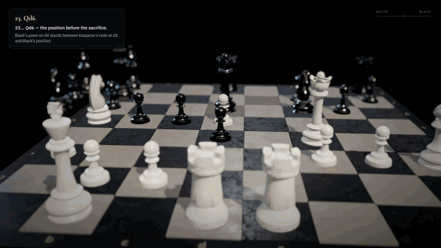
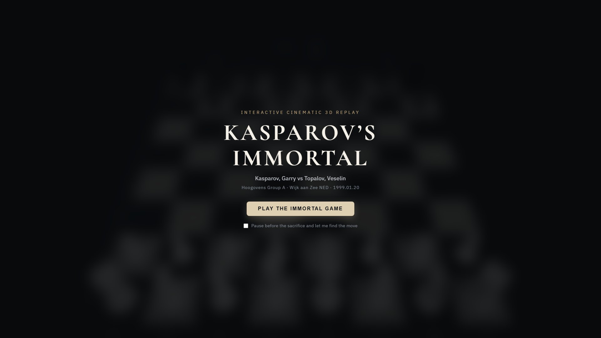
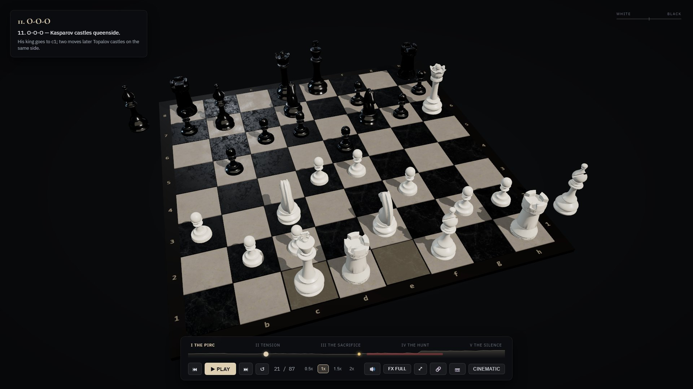
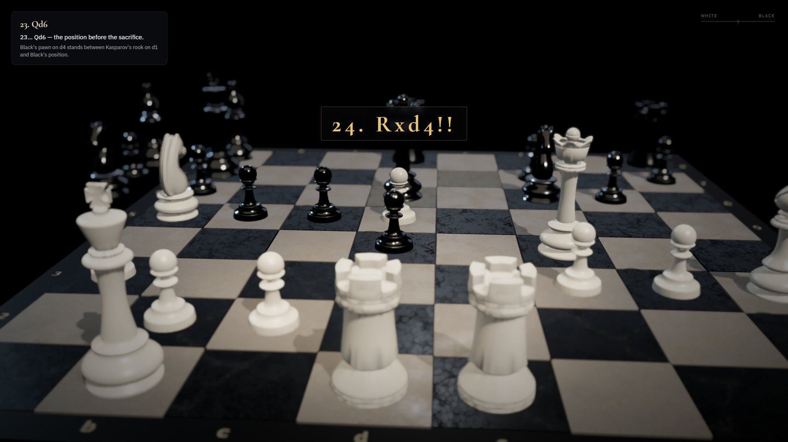
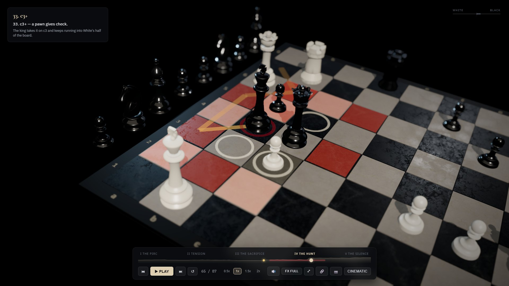
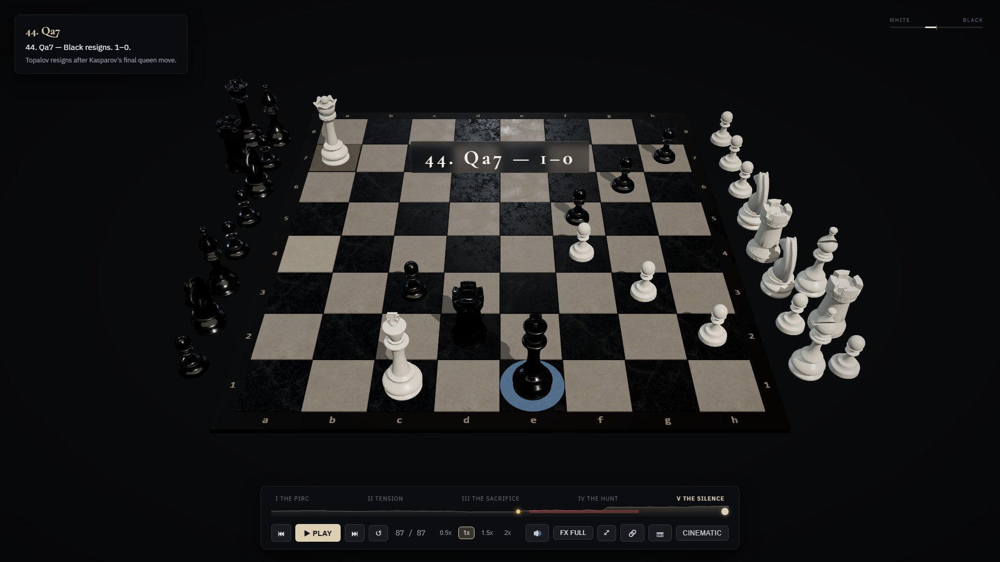
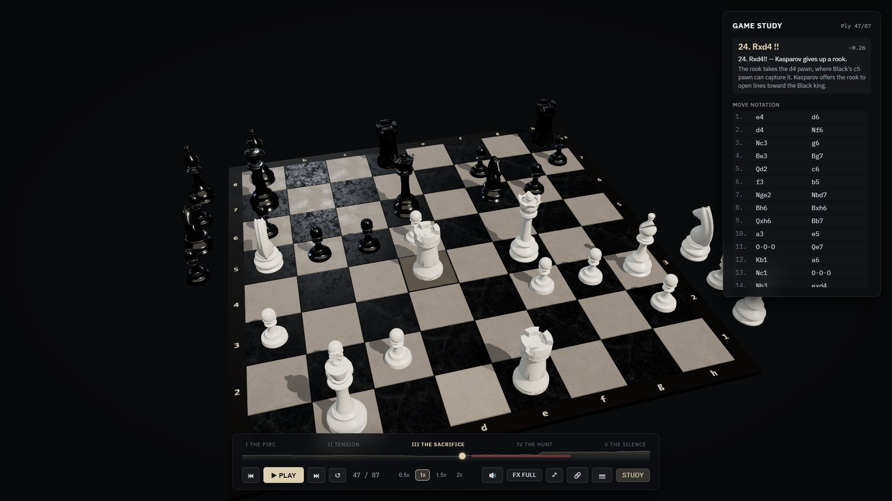
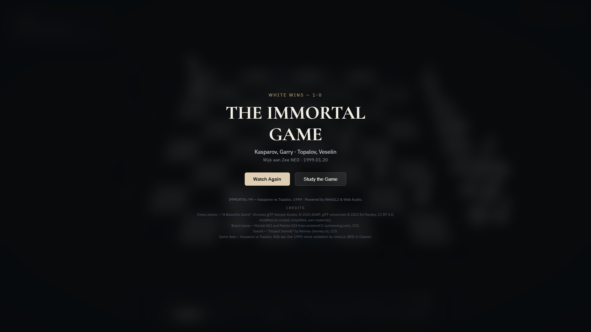

# IMMORTAL-99

**Kasparov vs Topalov, Wijk aan Zee 1999 — the most famous king hunt in chess history, retold as an interactive 3D film.**

**[▶ Watch it live](https://hoangphucloc1907.github.io/IMMORTAL-99/)** · [](https://github.com/hoangphucloc1907/IMMORTAL-99/actions/workflows/ci.yml)



On 20 January 1999 Garry Kasparov gave up a rook on d4 and then chased Veselin Topalov's king from a7 across the whole board to e1. IMMORTAL-99 replays all 87 plies of that game in the browser as a five-act documentary — camera work, light and sound timed to the moves — and lets you stop at any point to study the position.

Every position comes from the original PGN through `chess.js`, and the tests check every move, the king's path and the final position. Nothing on screen is invented: captions are written from the moves, and engine analysis is labelled as engine analysis.

---

## The film

| | |
|---|---|
|  |  |
| **Intro** — the game, the date, one button. Optional: pause before the sacrifice and find the move yourself. | **I · The Pirc** — 11. O-O-O. Kasparov's king goes to the queenside; two moves later Topalov's follows. |
|  |  |
| **III · The Sacrifice** — 24. Rxd4!!. Silence, a low camera on the rook, a slow approach, then a pause that reveals the open lines. | **IV · The Hunt** — 33. c3+. The net White controls around the king glows on the stone; rings mark the escapes it still has, the trail shows where it has been. |
|  |  |
| **V · The Silence** — 44. Qa7, 1–0. Slow motion, a long hold on the final position, then Black resigns. | **Study mode** — free camera, move list, an explanation for every move, engine evaluation and engine lines played out by ghost pieces. |



---

## What's in it

**Storytelling**
- **Five acts** with their own light, pacing and title cards: The Pirc · Tension · The Sacrifice · The Hunt · The Silence. A full playthrough runs about 2½ minutes at 1×.
- **Authored camera work for every ply**: over-the-shoulder, low angles, king tracking, a whip-pan on 31. Qxf6, a Dutch tilt late in the hunt, a slow pull-back on 44. Qa7 — all framed so the moving piece and the checked king stay on screen (tested at three screen sizes).
- **The sacrifice sequence** — overlay, title card, slow approach, a dissolve instead of an explosion, and a pause that draws the lines of attack — then 25. Re7+ as the payoff.
- **The king hunt** — a trail of the king's path, check pulses that intensify move by move, and a **pressure net**: the squares White controls around the king, with rings on its remaining escapes. The rings run out as the net closes. Both match `chess.js` on every ply.
- **Bullet-time** on 26. Qxd4+, a captured-material tray, a material balance bar, and documentary captions.

**Interaction**
- **Find the move** — opt in on the intro and the film stops before 24. Rxd4 and asks what Kasparov played.
- **Study mode** — orbit freely, click any move, read an explanation for all 87 plies, see the Stockfish evaluation, and watch the engine's lines for the king's alternatives played out by ghost pieces.
- **Deep links and sharing** — `?ply=47&mode=study` opens straight at a move; a share button copies the link (the system share sheet on mobile).
- **Photo mode** — hide the UI, orbit the board, save a PNG of the rendered frame.
- Scrubber with chapters and the evaluation curve, 0.5×–2× speed, keyboard shortcuts, controls that fade away while the film plays.

**Craft**
- **Photo-scanned marble board** (KTX2, Basis Universal) and the Khronos *A Beautiful Game* pieces in ivory and obsidian materials, studio reflections, post-processing on desktop.
- **Foley, not music** — wood and stone impacts with their own character for a move, a capture and a check; near-silence before the sacrifice. Web Audio, no audio library.
- **Accessible and adaptive** — moves and captions read out through `aria-live`, focus rings, `prefers-reduced-motion` (no tilts, whips or shake), a reduced-effects mode that also kicks in on slow devices, responsive layouts down to 390 px, a static fallback with the full game when WebGL2 is unavailable.

---

## How it's built

```
game (L0) → experience (L1) → effects · audio · store (L2) → animation (L3) → scene (L4) → ui (L5) → app
```

- **Layered, and enforced.** Each layer only imports the ones before it: chess logic knows nothing about rendering, the authored film (acts, shots, pacing, captions) is plain data, React never drives animation frames. ESLint rules per folder fail the build on a wrong import.
- **Seek is reconstruction, not playback.** Any ply can be rebuilt from scratch — pieces, captured tray, camera, light, fog, persistent effects — and every animation must end in exactly that state. Scrubbing in the middle of an animation leaves nothing behind.
- **One clock.** GSAP's own ticker is off; the render loop drives GSAP and camera damping together, and tests advance it by hand, so the same frame happens at the same time on every run.
- **Small up front.** Initial JavaScript is about **382 KB gzip**; Study mode, post-processing, the GLB and KTX2 loaders and rarely used screens load on demand. 3D assets total about 3.2 MB. Nothing is fetched from a third-party CDN at runtime (fonts and the texture transcoder are self-hosted).

| | |
|---|---|
| Build | Vite 8 (Rolldown) · TypeScript 6 (strict) |
| UI | React 19 · zustand 5 (vanilla store, event-rate updates only) |
| 3D | three.js 0.186 · React Three Fiber 9 · drei 10 · postprocessing 6 · WebGL2 |
| Animation | GSAP 3 timelines composed per move |
| Chess | chess.js 1.x · Stockfish 19 (offline, results committed as data) |
| Audio | Web Audio API |
| Assets | glTF-Transform + Meshopt (pieces) · Basis Universal KTX2 (board) |
| Quality | Vitest (107 tests) · Playwright (14 e2e tests, Chromium + WebKit) · ESLint 10 · Prettier |

---

## Run it

Requires **Node.js 22.12+** (or 24) and npm.

```bash
git clone https://github.com/hoangphucloc1907/IMMORTAL-99.git
cd IMMORTAL-99
npm install
npm run dev        # http://localhost:5173
```

```bash
npm run build      # typecheck + production bundle
npm run preview    # serve the bundle
```

### Checks

```bash
npm run typecheck      # TypeScript, strict
npm run lint           # ESLint, including the layer rules
npm run format:check   # Prettier
npm test               # Vitest: chess correctness, seek/playback state, framing, pacing, assets…
npx playwright install chromium webkit   # once
npm run test:e2e       # Playwright against the production build
```

### Assets and showcase

```bash
node scripts/buildAssets.mjs <ABeautifulGame.glb>          # pieces → src/assets/models/pieces.glb
node scripts/buildStoneTextures.mjs <dir>                  # ambientCG scans → src/assets/textures/*.ktx2
node scripts/genEval.mjs <path>/node_modules/stockfish     # Stockfish (installed outside the project) → annotations.eval.json
node scripts/captureScreenshots.mjs                        # with `npm run dev` running → docs/images/
```

---

## Keyboard

| Key | Action |
|---|---|
| `Space` | Play / pause |
| `←` `→` | Previous / next move |
| `R` | Replay the current move |
| `1` `2` `3` `4` | Speed 0.5× · 1× · 1.5× · 2× |
| `M` | Mute |
| `F` | Fullscreen |
| `P` | Photo mode on / off (`Esc` also leaves it) |

---

## License & credits

Code: [MIT](./LICENSE). Third-party assets keep their own licenses:

Chess pieces: **"A Beautiful Game"** from the Khronos glTF Sample Assets — © 2020 ASWF, glTF conversion © 2022 Ed Mackey, [CC BY 4.0](https://creativecommons.org/licenses/by/4.0/); re-scaled, simplified and given new materials. Board stone: **Marble 002** and **Marble 024** from [ambientCG](https://ambientcg.com), CC0. Sound: **"Impact Sounds"** by [Kenney](https://kenney.nl), CC0. Full sources, licenses and changes in [CREDITS.md](./CREDITS.md).
